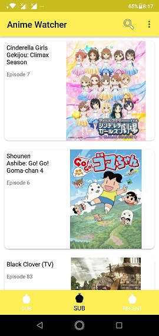
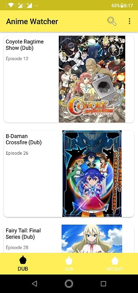
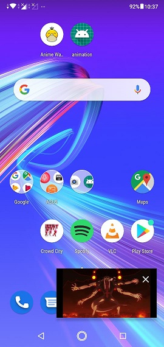
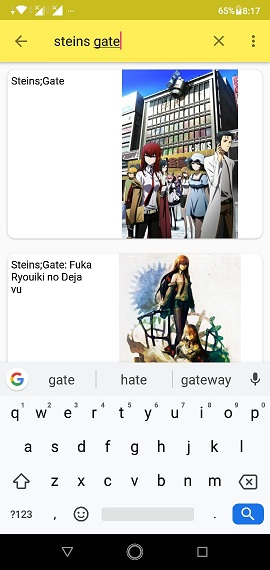
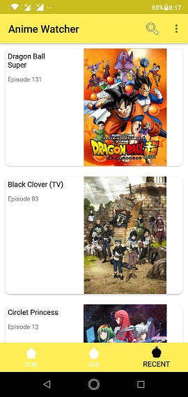
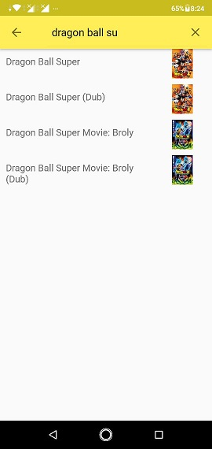

<h1> AnimeWatcher</h1>

 A simple app to watch anime without any ads .

It uses Jsoup to extract information from gogoanime website.

<h2>Features</h2>
<h3>Picture in Picture mode</h3>

<h3>Search Anime </h3>

<h3> Check recent anime you have watched</h3>

<h3>Anime List</h3>

 Contains 6142 Anime

<h2>Library used</h2>

Exoplayer- To show videos

Jsoup- for webscraping

Picasso - for displaying images and caching

